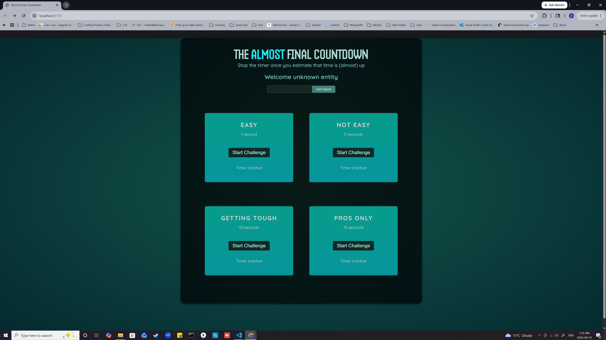

# Almost Final Countdown

A React-based timer challenge game where users test their timing accuracy by stopping a countdown as close as possible to a target time.

## Features

- Multiple difficulty levels
- Real-time countdown
- Accuracy-based score calculation
- Win / lose detection

## Tech Stack

- React
- JavaScript (ES6+)
- Vite

## Key Concepts

- useState for managing timer state
- useRef for storing timer IDs and controlling the modal
- setInterval & clearInterval for time control
- Component-based architecture

## Run the Project

npm install  
npm run dev  

## About

Built as a practice project to strengthen core React concepts such as state management, refs and timing logic.